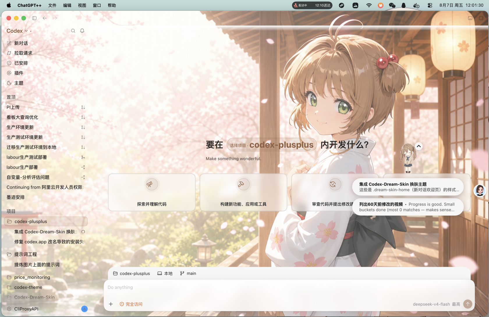
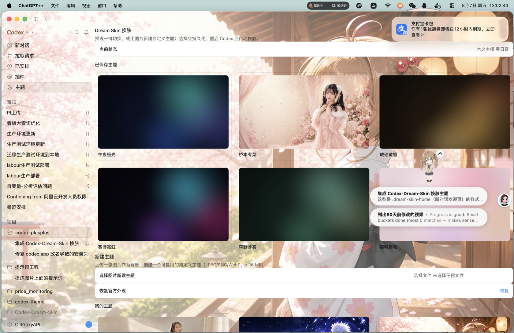

# ChatGPT++

**English** | [简体中文](./README.zh-CN.md)

ChatGPT++ lets you install local tweaks into the OpenAI ChatGPT desktop app. Tweaks
can change UI, add settings pages, run main-process code, and use native
OS-level features through the ChatGPT++ bridge.
[Join the Discord community](https://discord.gg/6bY6gGX36H).



> Unofficial project. Not affiliated with OpenAI. Use at your own risk.

## TL;DR

ChatGPT++ patches your local ChatGPT app so ChatGPT loads a small ChatGPT++ runtime on
startup.

That runtime lives in your user data directory, not inside ChatGPT. It finds
tweaks in a local `tweaks/` folder and loads them when ChatGPT opens.

The app patch is tiny. Your tweaks, config, logs, backups, and runtime files
stay outside the app bundle, so you can edit tweaks without rebuilding ChatGPT.

When ChatGPT updates, the patch is usually removed. ChatGPT++ installs a watcher
that notices this and re-applies the patch.

1.0.0 adds cleaner patching, better debug output, Owl runtime detection,
browser-host debugging, and native bridge support for AppKit, Metal, helper
processes, and tweak-owned native modules.

## Table Of Contents

- [Install](#install)
- [What ChatGPT++ Is](#what-chatgpt-is)
- [How It Works](#how-it-works)
- [Common Commands](#common-commands)
- [Where Files Live](#where-files-live)
- [Writing Tweaks](#writing-tweaks)
- [Dream Skin Theme](#dream-skin-theme)
- [Owl And Native Bridge](#owl-and-native-bridge)
- [Browser Host Mode](#browser-host-mode)
- [Updates And Recovery](#updates-and-recovery)
- [Security](#security)
- [More Docs](#more-docs)

## Install

Agentic install, from Codex:

```text
Inspect and install this for me: https://github.com/Shunlly/chatgpt-plusplus
Tell me where you install it and send me the local path for adding new tweaks.
```

Homebrew:

```sh
brew install Shunlly/chatgpt-plusplus/chatgptplusplus
chatgptplusplus install
```

Installer packages (DMG / EXE):

GitHub Releases ships self-contained installers (no Node.js needed): `.dmg` for macOS and `*-setup.exe` for Windows.

- macOS: open the dmg, double-click `ChatGPT++.app` (or drag it into Applications); a Terminal window opens and runs `install`.
- Windows: run the setup; it patches ChatGPT/Codex on finish, with an "Install & Repair" entry in the Start menu.

Installer installs are separate from source installs. To update an installer install, download the new installer from GitHub Releases (`update` prints this hint instead of overwriting the binary).

GitHub source installer:

```sh
curl -fsSL https://raw.githubusercontent.com/Shunlly/chatgpt-plusplus/main/install.sh | bash
```

Windows PowerShell:

```powershell
irm https://raw.githubusercontent.com/Shunlly/chatgpt-plusplus/main/install.ps1 | iex
```

Bun:

```sh
bun install -g github:Shunlly/chatgpt-plusplus
chatgptplusplus install
```

After install, launch ChatGPT++. Open Settings and look for the ChatGPT++
section.

## What ChatGPT++ Is

ChatGPT++ is a tweak loader for the ChatGPT desktop app.

It gives you:

- A local `tweaks/` folder.
- A runtime that loads renderer and main-process tweaks.
- A ChatGPT++ Settings section inside ChatGPT.
- CLI tools for install, repair, update, debug, and tweak development.
- A watcher that repairs ChatGPT++ after ChatGPT updates.
- A public SDK for tweak authors.
- Native bridge APIs for advanced macOS tweaks.

It does not replace ChatGPT, proxy your account, or run a separate ChatGPT clone.
It modifies your installed app so it can load local code.

## How It Works

Install flow:

1. ChatGPT++ finds your ChatGPT app.
2. It backs up the unpatched app files.
3. It patches ChatGPT `app.asar` so a ChatGPT++ loader runs first.
4. It stages the ChatGPT++ runtime in your user data directory.
5. It re-signs the app when needed.
6. It installs a watcher for future ChatGPT updates.

Runtime flow:

1. You launch ChatGPT++.
2. The ChatGPT++ loader starts.
3. The loader starts the ChatGPT++ runtime from disk.
4. ChatGPT starts normally.
5. ChatGPT++ discovers enabled tweaks.
6. Renderer tweaks run in ChatGPT windows.
7. Main-process tweaks run in the ChatGPT main process.
8. The Settings UI shows ChatGPT++ pages and tweak controls.

## Common Commands

| Command | What it does |
|---|---|
| `chatgptplusplus install` | Patch ChatGPT and install the runtime. |
| `chatgptplusplus status` | Show installed version and patch state. |
| `chatgptplusplus debug` | Show app path, runtime type, paths, open state, and bridge status. |
| `chatgptplusplus repair` | Re-apply the patch after an app update or broken install. |
| `chatgptplusplus update` | Update ChatGPT++ from the latest GitHub release. |
| `chatgptplusplus update-codex` | Prepare ChatGPT for its official updater, then re-patch after restart. |
| `chatgptplusplus doctor` | Diagnose signatures, integrity, permissions, and common failures. |
| `chatgptplusplus safe-mode` | Disable all tweaks without deleting them. |
| `chatgptplusplus safe-mode --off` | Leave safe mode. |
| `chatgptplusplus uninstall` | Remove ChatGPT++ and restore the app when safe. |
| `chatgptplusplus uninstall --purge` | Also delete tweaks, config, logs, backups, and ChatGPT++ user data. |

Tweak development commands:

| Command | What it does |
|---|---|
| `chatgptplusplus create-tweak ./my-tweak` | Create a new tweak folder. |
| `chatgptplusplus validate-tweak ./my-tweak` | Validate a tweak manifest and entry file. |
| `chatgptplusplus dev ./my-tweak` | Link a local tweak into ChatGPT++ for development. |

Source checkout commands:

```sh
npm run build
npm test
node packages/installer/dist/cli.js install
node packages/installer/dist/cli.js debug
```

## Where Files Live

ChatGPT++ keeps almost everything outside ChatGPT++.

| Item | Location |
|---|---|
| Loader patch | Inside ChatGPT `app.asar` |
| Runtime | `<user-data-dir>/runtime/` |
| Tweaks | `<user-data-dir>/tweaks/` |
| Tweak data | `<user-data-dir>/tweak-data/` |
| Config | `<user-data-dir>/config.json` |
| State | `<user-data-dir>/state.json` |
| Logs | `<user-data-dir>/log/` |
| Backups | `<user-data-dir>/backup/` |

Default user data paths:

| OS | Path |
|---|---|
| macOS | `~/Library/Application Support/chatgpt-plusplus/` |
| Windows | `%APPDATA%/chatgpt-plusplus/` |
| Linux | `$XDG_DATA_HOME/chatgpt-plusplus/` or `~/.local/share/chatgpt-plusplus/` |

On Windows Store installs, ChatGPT++ also creates a writable managed app copy
under `%LOCALAPPDATA%/chatgpt-plusplus/store-apps/`. Use the ChatGPT++ shortcut for
that copy.

## Writing Tweaks

A tweak is a folder with a manifest and an entry file:

```text
my-tweak/
  manifest.json
  index.js
```

Minimal `manifest.json`:

```json
{
  "id": "com.you.my-tweak",
  "name": "My Tweak",
  "version": "0.1.0",
  "githubRepo": "you/my-tweak",
  "description": "Adds a ChatGPT++ settings page.",
  "scope": "renderer",
  "main": "index.js"
}
```

Minimal `index.js`:

```js
module.exports = {
  start(api) {
    api.settings.registerPage({
      id: "main",
      title: api.manifest.name,
      render(root) {
        root.textContent = "Hello from ChatGPT++.";
      },
    });
  },
  stop() {},
};
```

Local dev loop:

```sh
chatgptplusplus create-tweak ./my-tweak --id com.you.my-tweak --name "My Tweak"
chatgptplusplus validate-tweak ./my-tweak
chatgptplusplus dev ./my-tweak
```

Full docs are in [Writing Tweaks](./docs/WRITING-TWEAKS.md).

## Dream Skin Theme

This repo ships `tweaks/dream-skin`, a theme switcher that restyles the ChatGPT
desktop app from uploaded images.

- A **Theme** entry in the main sidebar: New chat → Pull requests → Scheduled → Plugins → **Theme**.
- One-click switching between saved preset and custom themes.
- Create a new theme by uploading an image; colors are extracted and applied to the whole app.
- The new-chat composer stays visible without scrolling, ready to type immediately.



## Owl And Native Bridge

Current macOS ChatGPT builds use Owl: a native app shell with Chromium and an
Electron-compatible JavaScript runtime.

ChatGPT++ 1.0.0 detects Owl and reports capability status through:

```sh
chatgptplusplus debug
```

Tweak authors should use the ChatGPT++ SDK, not raw Owl internals:

- `api.codex.runtime.getInfo()`
- `api.codex.runtime.getCapabilities()`
- `api.codex.windows.*`
- `api.codex.cdp.*`
- `api.codex.native.*`

Native bridge support includes:

- Tweak-owned `.node` modules.
- Objective-C++/N-API shims for Swift, AppKit, Metal, and MetalKit.
- Native child panels.
- Metal-backed child-window overlays.
- Helper processes.

Start with [Native Bridge](./docs/tweaks/native-bridge.md).

## Browser Host Mode

Browser host mode opens the ChatGPT UI in a normal browser tab while a
hidden ChatGPT window provides the private app bridge:

```sh
chatgptplusplus browser --port 8765
```

Then open:

```text
http://127.0.0.1:8765/
```

This is useful for debugging and browser automation. It is experimental. The
in-app browser uses iframe shims in this mode, so some websites may block
embedding.

## Updates And Recovery

Update ChatGPT++:

```sh
chatgptplusplus update
```

> When installed from a dmg/exe package, `update` does not replace the binary — it points you to the latest GitHub release. `repair` still works as usual.

Run the official ChatGPT updater on macOS:

```sh
chatgptplusplus update-codex
```

Repair ChatGPT++:

```sh
chatgptplusplus repair --force
```

Disable tweaks temporarily:

```sh
chatgptplusplus safe-mode
```

Re-enable normal tweak loading:

```sh
chatgptplusplus safe-mode --off
```

Uninstall:

```sh
chatgptplusplus uninstall
```

Clean uninstall, including tweaks/config/logs/backups:

```sh
chatgptplusplus uninstall --purge
```

## Security

ChatGPT++ runs local code inside your ChatGPT desktop app. Install tweaks only from
sources you trust.

Important details:

- ChatGPT++ does not silently update tweak files.
- Tweak update checks link to GitHub Releases for review.
- Native tweaks can run native code and need extra review.
- Native bridge paths are restricted to files inside the tweak directory.
- Tweak data APIs default to ChatGPT++'s user data directory.

See [Security](./SECURITY.md).

## More Docs

- [Architecture](./docs/ARCHITECTURE.md)
- [Troubleshooting](./docs/TROUBLESHOOTING.md)
- [Writing Tweaks](./docs/WRITING-TWEAKS.md)
- [Tweak API Reference](./docs/tweaks/api-reference.md)
- [Manifest Reference](./docs/tweaks/manifest.md)
- [Runtime And Lifecycle](./docs/tweaks/runtime-lifecycle.md)
- [UI And DOM Patterns](./docs/tweaks/ui-and-dom.md)
- [MCP Servers](./docs/tweaks/mcp.md)
- [Owl Runtime Surface](./docs/OWL-RUNTIME.md)
- [Owl Bridge Roadmap](./docs/OWL-BRIDGE-ROADMAP.md)

## Credits

ChatGPT++ is a continuation of the codex-plusplus tweak system for the Codex desktop app.
The MIT license header retains the original copyright (c) 2026 Bennett.

## Contributors

- [Alex Naidis (@TheCrazyLex)](https://github.com/TheCrazyLex) - macOS
  permission hardening and sudo install handling.

## License

MIT.
