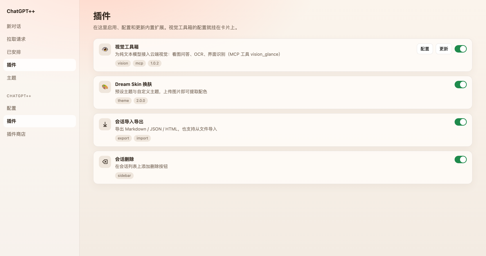
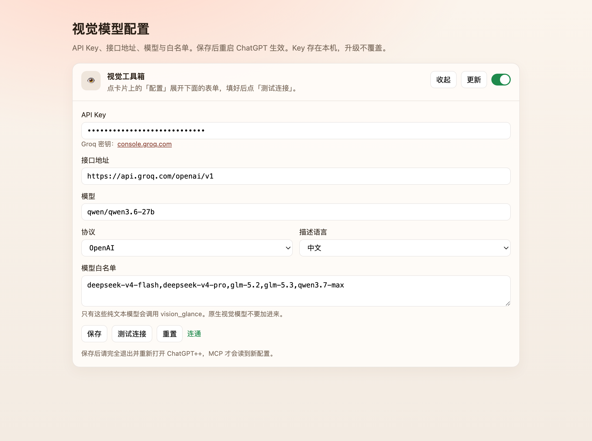

# ChatGPT++

[English](./README.md) | **简体中文**

给 OpenAI ChatGPT / Codex 桌面应用装本地插件：换肤、看图、导入导出会话。运行时在用户目录，不塞进应用包。
[Discord](https://discord.gg/6bY6gGX36H)


> 非官方项目，与 OpenAI 无关。请自行承担使用风险。

## 安装

推荐从 [GitHub Releases](https://github.com/Shunlly/chatgpt-plusplus/releases) 下载安装包（不用装 Node）：

| 系统 | 文件 |
|---|---|
| macOS Apple Silicon | `ChatGPT++-<version>-macos-arm64.dmg` |
| Windows x64 | `ChatGPT++-<version>-win-x64-setup.exe` |

- macOS：打开 dmg，把 `ChatGPT++.app` 拖进「应用程序」。若提示已损坏：`xattr -dr com.apple.quarantine "/Applications/ChatGPT++.app"`，然后右键打开。
- Windows：运行 setup，装完会打补丁。开始菜单里有「Install & Repair」。

更新也走 Releases，下新包覆盖即可。`chatgptplusplus update` 对安装包安装不会替换二进制，会提示去 Releases。

其他方式：

```sh
brew install Shunlly/chatgpt-plusplus/chatgptplusplus
chatgptplusplus install
```

```sh
curl -fsSL https://raw.githubusercontent.com/Shunlly/chatgpt-plusplus/main/install.sh | bash
```

```powershell
irm https://raw.githubusercontent.com/Shunlly/chatgpt-plusplus/main/install.ps1 | iex
```

装好后打开 **ChatGPT++**。侧边栏应能看到 **插件**、**主题**。设置里有 ChatGPT++ 的「配置 / 插件 / 插件商店」。

## 内置插件

打开侧边栏 **插件**，或设置 → ChatGPT++ → **插件**。每个卡片可开关；有 GitHub 地址的卡片带 **更新**。



| 插件 | 做什么 |
|---|---|
| **视觉工具箱** | 让 DeepSeek 等纯文本模型也能看图 |
| **Dream Skin** | 换肤，上传图片提取配色 |
| **会话导入导出** | Markdown / JSON / HTML |
| **会话删除** | 会话列表上的删除按钮 |

### 视觉工具箱

纯文本模型本身不能看图。这个插件提供 MCP 工具 `vision_glance`：把图片发给你配置的多模态接口，把识别结果交回当前模型。

**用之前先配好，否则发图没反应。**

1. 打开 **插件**，找到 **视觉工具箱**，确认开关打开。
2. 点卡片上的 **配置**。
3. 填 API Key、接口地址、模型。默认走 Groq OpenAI 兼容接口，密钥在 [console.groq.com](https://console.groq.com/keys)。
4. 点 **测试连接**，看到「连通」再 **保存**。
5. **完全退出并重新打开 ChatGPT++**（Force Reload 不够，MCP 进程要重拉）。
6. 换一个白名单里的模型（如 `deepseek-v4-pro`），发一张图问「图里有什么」。



要点：

- 配置写在本机 `tweak-data/com.chatgpt-plusplus.vision-toolkit/config.json`，升级不会冲掉。
- **白名单**里才是会调用 `vision_glance` 的纯文本模型。GPT-4o、Gemini 这类原生会看图的模型不要加进去。
- MCP 服务名是 `visiontoolkit`（不能带横杠）。改完配置必须重启。
- 改 Key / 接口后若仍走旧模型：退出 ChatGPT++ 再开，不要只 Force Reload。

更细的说明见 [tweaks/vision-toolkit/README.md](./tweaks/vision-toolkit/README.md)。

### Dream Skin

侧边栏 **主题**：预设一键切换，上传图片可新建主题。


### 关掉时还在跑的会话

对话进行中直接退出 ChatGPT++，重启后宠物窗顶部会列出 **中断的会话**。点标题打开主窗口，点 × 忽略。

## 常用命令

| 命令 | 作用 |
|---|---|
| `chatgptplusplus install` | 打补丁并安装运行时 |
| `chatgptplusplus status` | 版本和补丁状态 |
| `chatgptplusplus repair` | 官方应用更新后重新打补丁 |
| `chatgptplusplus update` | 从 GitHub 更新（安装包安装会提示去 Releases） |
| `chatgptplusplus doctor` | 签名、权限等诊断 |
| `chatgptplusplus safe-mode` | 临时关掉全部插件 |
| `chatgptplusplus uninstall` | 卸载；`--purge` 连配置日志一起删 |

Tweak 开发：`create-tweak` / `validate-tweak` / `dev`。

## 文件放哪

| 内容 | 位置 |
|---|---|
| 运行时 | `<user-data>/runtime/` |
| 插件 | `<user-data>/tweaks/` |
| 插件数据（含视觉配置） | `<user-data>/tweak-data/` |
| 配置 / 日志 / 备份 | `<user-data>/config.json` `log/` `backup/` |

macOS：`~/Library/Application Support/chatgpt-plusplus/`  
Windows：`%APPDATA%/chatgpt-plusplus/`

## 编写 Tweak

目录里放 `manifest.json` + `index.js`。完整文档：[编写 Tweak](./docs/WRITING-TWEAKS.md)。

```json
{
  "id": "com.you.my-tweak",
  "name": "My Tweak",
  "version": "0.1.0",
  "description": "Adds a ChatGPT++ settings page.",
  "scope": "renderer",
  "main": "index.js"
}
```

```js
module.exports = {
  start(api) {
    api.settings.registerPage({
      id: "hello",
      title: "Hello",
      render(el) { el.textContent = "Hello from my tweak."; },
    });
  },
  stop() {},
};
```

```sh
chatgptplusplus create-tweak ./my-tweak --id com.you.my-tweak --name "My Tweak"
chatgptplusplus validate-tweak ./my-tweak
chatgptplusplus dev ./my-tweak
```

MCP 插件在 manifest 里声明 `mcp`，服务名只用字母数字（见视觉工具箱的 `"name": "visiontoolkit"`）。参考 [MCP 服务器](./docs/tweaks/mcp.md)。

## Owl 与原生桥接

当前 macOS ChatGPT 使用 Owl。能力探测：`chatgptplusplus debug`。原生 API 见 [原生桥接](./docs/tweaks/native-bridge.md)。

## 浏览器宿主（实验）

```sh
chatgptplusplus browser --port 8765
```

打开 `http://127.0.0.1:8765/`。

## 更新与恢复

```sh
chatgptplusplus repair --force
chatgptplusplus safe-mode
chatgptplusplus safe-mode --off
chatgptplusplus uninstall
chatgptplusplus uninstall --purge
```

官方 ChatGPT 更新后补丁可能掉，watcher 会尝试重打；不行就 `repair`。

## 安全

插件在 ChatGPT 进程里跑本地代码。只装信任来源。ChatGPT++ 不会静默改 tweak 文件。见 [SECURITY.md](./SECURITY.md)。

## 系统要求

macOS 14+ / Windows 10 1809+ / Linux（systemd）。建议 8GB 内存。性能见 [docs/PERFORMANCE.md](./docs/PERFORMANCE.md)，排障见 [docs/TROUBLESHOOTING.md](./docs/TROUBLESHOOTING.md)。

## 更多文档

- [架构](./docs/ARCHITECTURE.md)
- [编写 Tweak](./docs/WRITING-TWEAKS.md)
- [Tweak API](./docs/tweaks/api-reference.md)
- [Manifest](./docs/tweaks/manifest.md)
- [MCP](./docs/tweaks/mcp.md)

## 许可证

MIT。致谢见英文 README。上游版权（c）2026 Bennett。
